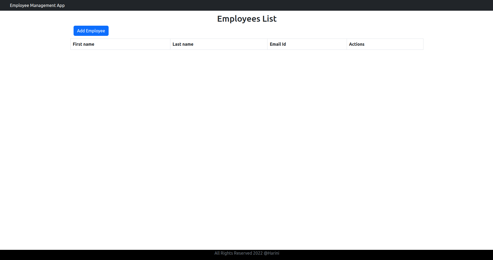
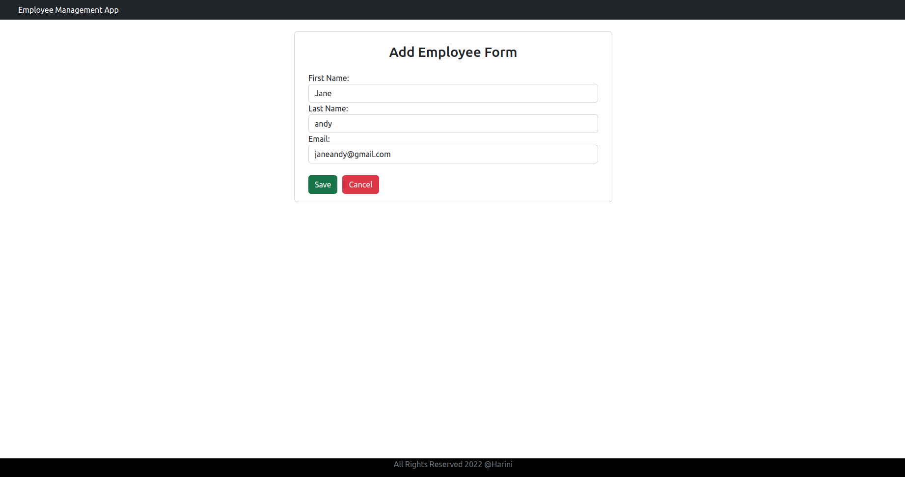
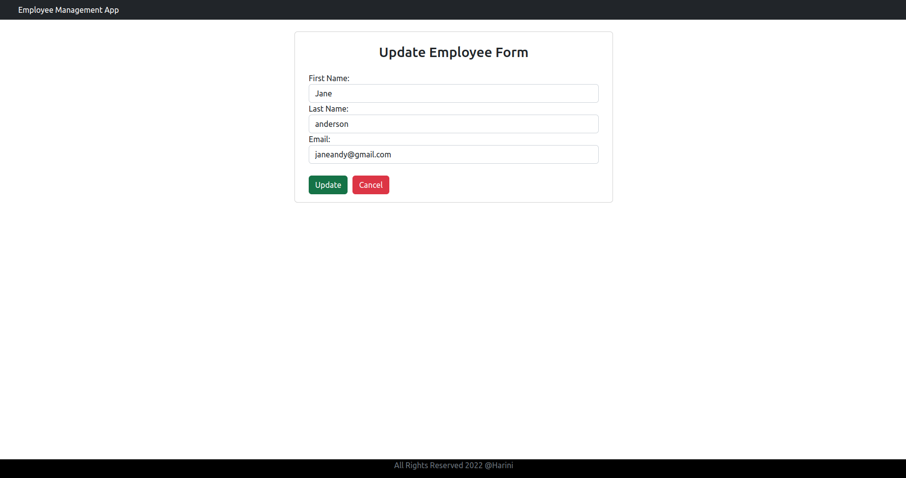
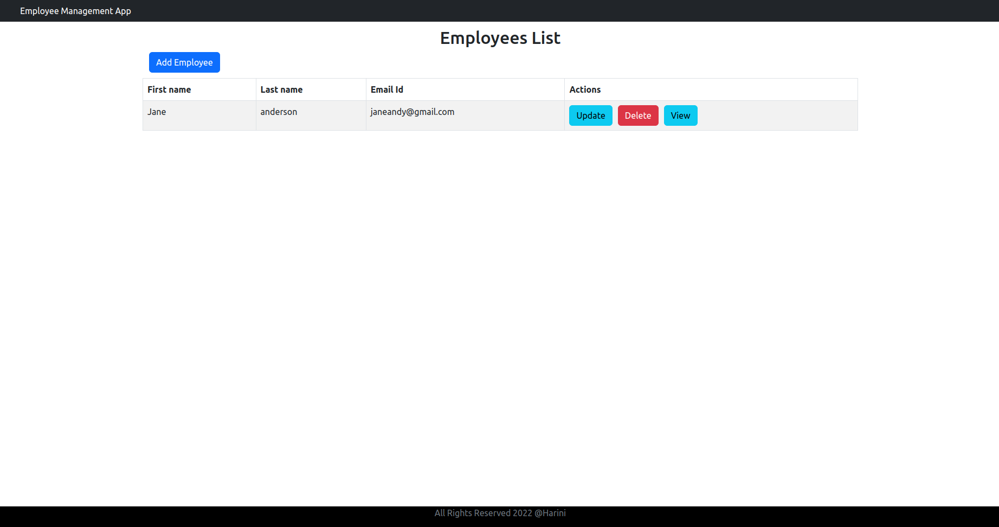

Commands to run:
1. Run the SpringBoot application 
2. Start the React App 

```
cd react-frontend
npm install
npm start
```

Requirements installation:

```
npm install bootstrap -save
npm install axios 
npm install react-router-dom
```

<h1>Home Page</h1>

<h1>Add Employee Page</h1>

<h1>Updated Home Page</h1>

<h1>Update Page</h1>

<h1>Updated Home Page</h1>
